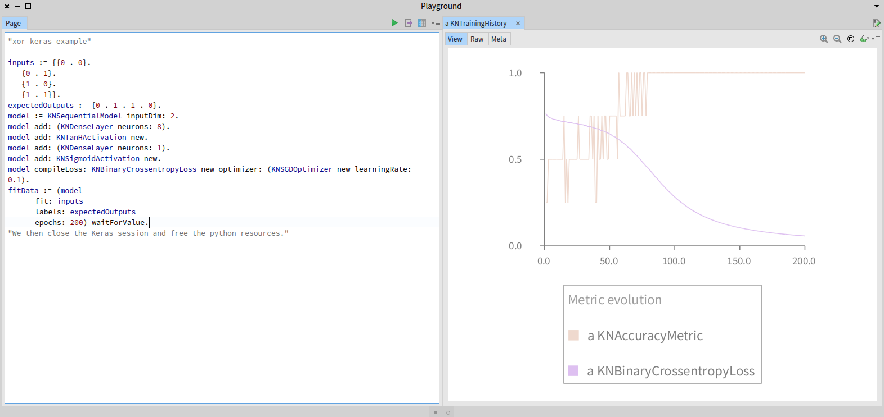

# KerasWrapper
[Keras](https://keras.io) bindings for Pharo. This binding allows to use Keras (implemented in Python) within Pharo. For the Pharo programmer, the fact that Keras is written in Python is completely transparent.

# Installing KerasWrapper

The following code loads the KerasWrapper in Pharo:

```Smalltalk
Gofer it
    smalltalkhubUser: 'ObjectProfile' project: 'Keras-Wrapper';
    configurationOf: 'KerasWrapper';
    loadDevelopment.
```  

You then needs to install Python, TensorFlow, and Keras. In the help menu, we provide detalled instruction on how to do so.

# Simple Example

Here is the XOR simple example in Pharo

```Smalltalk
inputs := {{0 . 0}.
	{0 . 1}.
	{1 . 0}.
	{1 . 1}}.
expectedOutputs := {0 . 1 . 1 . 0}.
model := KNSequentialModel inputDim: 2.
model add: (KNDenseLayer neurons: 8).
model add: KNTanHActivation new.
model add: (KNDenseLayer neurons: 1).
model add: KNSigmoidActivation new.
model compileLoss: KNBinaryCrossentropyLoss new optimizer: (KNSGDOptimizer new learningRate: 0.1).
fitData := (model
		fit: inputs
		labels: expectedOutputs
		epochs: 200) waitForValue.
```

Evaluating the code produce the following:


The Pharo code given above is inspired from the [pure python version](https://gist.github.com/stewartpark/187895beb89f0a1b3a54)
